# Results

## Experiment 1: Pod Failure (Pod Kill)

### Objective 
Simulate an unexpected frontend pod crash and observe Kubernetes self-healing behavior, measuring the impact on request error rate and system recovery time.

### Theory 
Chaos Mesh implements a pod kill by issuing a direct deletion request to the Kubernetes API server, targeting the selected pod. The controller identifies the pod matching the label selector and calls the exact same API endpoint that executing kubectl delete pod would invoke.

Upon receiving this request, the container runtime (e.g., containerd) receives a SIGTERM signal and immediately stops the container. Because Kubernetes constantly monitors the state of the cluster, it quickly detects the pod as terminated. The owning ReplicaSet controller immediately responds to this state change by creating a replacement pod to satisfy the declared replica count.

The injection operates entirely through the standard Kubernetes control plane—no direct process-level or kernel-level manipulation is involved. This ensures that the failure is clean and instantaneous, with no partial state or corrupted data left behind. The primary goal of this experiment is to observe how quickly the system's self-healing mechanisms restore the required number of replicas (Mean Time To Recovery) and how the brief unavailability impacts user traffic.

### Baseline (pre-experiment)

Prior to the experiment, all pods were ready and running.
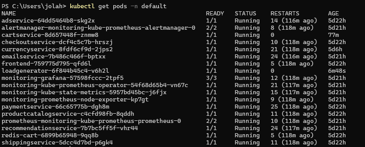


The frontend pod (`frontend-759775d795-qfd6l`) was operating within normal parameters. CPU usage stood at 0.047 cores (47% of requested, 23.5% of limit), with CPU throttling at 28.1%. The load generator recorded 937 requests with a 0% failure rate, an average response time of 82 ms.

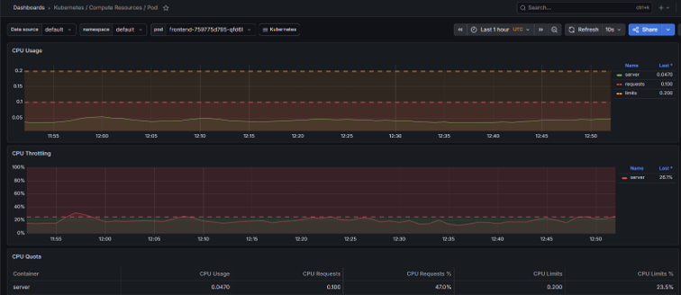

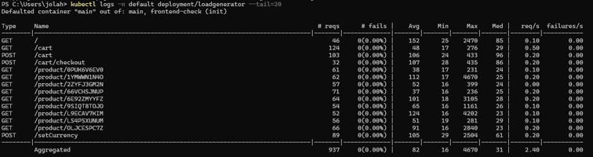


### Experiment Execution

1. **Creating the manifest**
The pod kill was injected via Chaos Mesh. The injection was specified by the following `.yaml` file:

```yaml
apiVersion: chaos-mesh.org/v1alpha1
kind: PodChaos
metadata:
  name: pod-kill-frontend
  namespace: chaos-mesh
spec:
  action: pod-kill
  mode: one
  selector:
    namespaces:
      - default
    labelSelectors:
      "app": "frontend"
```

2. **Applying the experiment:**
```bash
kubectl apply -f network-partition.yaml
```

3. **Observing the system:**
```bash
kubectl get pods -n default --sort-by='.lastTimestamp' | Select-String "frontend"
```
The following sequence was observed:
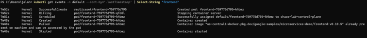


| Time | Event |
|---|---|
| T+0s | Killing — pod `frontend-759775d795-qfd6l` stopped |
| T+0s | SuccessfulCreate — new pod `frontend-759775d795-khbmz` created by ReplicaSet |
| T+1s | Scheduled — new pod assigned to node |
| T+4s | Created + Pulled — container created, image already cached locally |
| T+6s | Started — container running |

**Mean Time To Recovery (MTTR):** 7m52s − 7m46s = **6 seconds**

Recovery was exceptionally fast due to the container image being present in the local node cache, eliminating the image pull step entirely.
In Grafana we can see that new pod was created almost immediately:
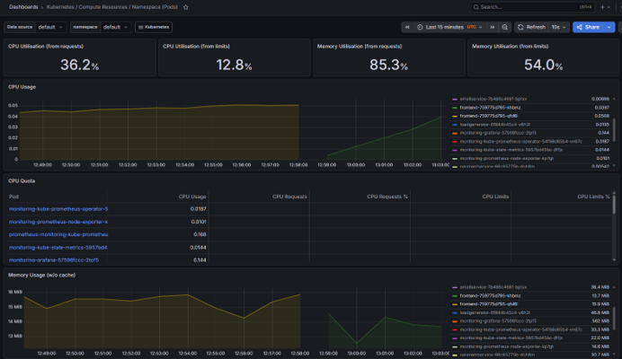


### Load Generator Comparison

```bash
kubectl logs -n default deployment/loadgenerator --tail=20
```

| Metrics | Before | After | Change |
|---|---|---|---|
| Total requests | 937 | 3275 | — |
| Failures | 0 (0.00%) | 21 (0.64%) | spike |
| Avg response time | 82 ms | 128 ms | +56% |
| Max response time | 4670 ms | 19685 ms | +322% |

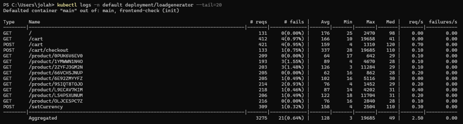


### Error Rate and Latency — Impact Observed

After the experiment, the load generator recorded a cumulative failure rate of 0.64% (21 out of 3275 requests), compared to 0% before the experiment. Average response time increased from 82 ms to 128 ms (+56%), reflecting the brief period during which the frontend was unavailable. Max response time reached 19685 ms (+322%) after running the experiment.

Importantly, the failures were limited to the disruption window only.

### Conclusions

- Kubernetes self-healing operated automatically and without manual intervention, restarting the frontend pod within 6 seconds.
- The brief unavailability window caused a measurable but contained error spike (0.64% of total requests), with no persistent degradation after recovery.
- The elevated average response time (128 ms vs 82 ms baseline) reflects request failures and retries during the disruption window rather than ongoing latency degradation.
- The absence of image pull delay (cached image) was a key factor in achieving sub-10-second MTTR. In a cold-start scenario (no cached image), MTTR would take much longer.

## Experiment 2: Network Partition

### Objective
Simulate a network-level communication failure between the frontend and checkoutservice, and observe the system's partial degradation behavior and recovery.

### Theory
Chaos Mesh implements network partitions by injecting iptables rules directly into the network namespace of the targeted pod on the cluster node. When the experiment is applied, the Chaos Mesh daemon running on the node executes the equivalent of network dropping rules (e.g., iptables -A OUTPUT ... -j DROP).

These rules cause the Linux kernel to silently drop all IP packets traveling between the two specified pods in the targeted direction. Neither pod is aware of the rule. From the application's perspective, packets are sent but never arrive, and no TCP connection is successfully established.

Because the packets are silently dropped rather than explicitly rejected, this results in connection timeouts rather than immediate "connection refused" errors. Application requests will hang open until they hit their maximum HTTP timeout threshold before finally failing. This perfectly simulates real-world degraded network hardware or misconfigured routing.

When the experiment duration elapses, Chaos Mesh removes the injected iptables rules, restoring full network connectivity. Because the rules are stateless and operate at the packet level, recovery is instantaneous—no application restart or reconnection handshake is required.

### Baseline (pre-experiment)

Prior to the experiment, all 14 monitored endpoints reported a 0% failure rate. The checkout endpoint (`POST /cart/checkout`) recorded an average response time of 139ms with no failures across 119 requests. Overall system throughput was stable at 1.80 req/s.

Prior to conducting network partition experiments, liveness and readiness probe timeouts were increased from the default 1 second to 10 seconds across all application deployments. This adjustment was necessary to prevent probe-induced cascading failures in the single-node Kind environment, where iptables-based network rules affect all pod-to-pod traffic on the node. Without this change, health probes would begin failing within ~15 seconds of partition injection, triggering Kubernetes to kill and restart unrelated pods.

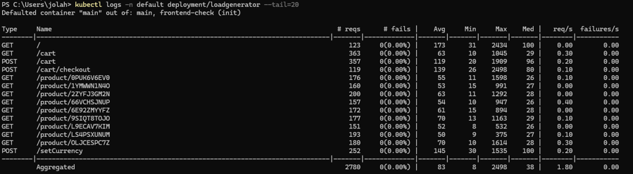


### Experiment Execution
1. **Creating the manifest**
The network partition was injected via Chaos Mesh. The injection was specified by the following `.yaml` file:

```yaml
apiVersion: chaos-mesh.org/v1alpha1
kind: NetworkChaos
metadata:
  name: partition-frontend-checkout
  namespace: default
spec:
  action: partition
  mode: all
  duration: "60s"
  selector:
    namespaces:
      - default
    labelSelectors:
      app: frontend
  direction: to
  target:
    mode: all
    selector:
      namespaces:
        - default
      labelSelectors:
        app: checkoutservice
```

2. **Applaying the manifest**

```bash
kubectl apply -f partition-frontend-checkout.yaml
```
Watch Cluster Events in Real-Time: 

```bash
kubectl get events -n default --sort-by='.lastTimestamp' -w
```

| Time | Event |
|---|---|
| T+0s | Experiment started |
| T+2s | Network partition applied to frontend and checkoutservice pods |
| T+59s | Duration elapsed |
| T+60s | Partition automatically removed, services recovered |

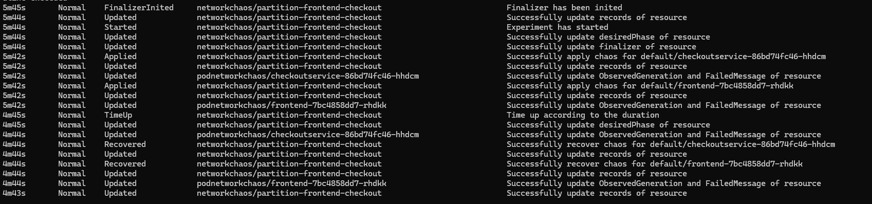

3. **Observing the system:**
```bash
kubectl logs -n boutique deployment/loadgenerator --tail=20 -f
```

The network partition produced a clean, isolated failure confined exclusively to the `POST /cart/checkout` endpoint. All other 13 endpoints maintained a 0% failure rate throughout the experiment, confirming the expected partial degradation behavior.

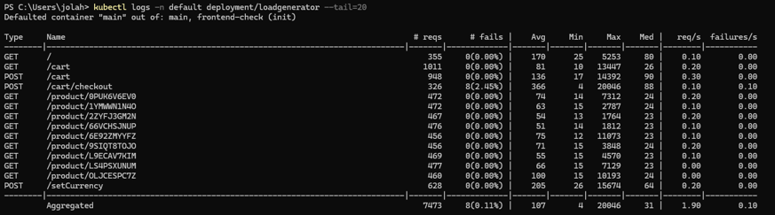


| Metric | Baseline | During Partition | Change |
|---|---|---|---|
| `POST /cart/checkout` failure rate | 0.00% | 2.45% | increase |
| `POST /cart/checkout` avg response time | 139ms | 366ms | +163% |
| `POST /cart/checkout` max response time | 2498ms | 20046ms | timeout |
| All other endpoints failure rate | 0.00% | 0.00% | — |
| Overall failure rate | 0.00% | 0.11% | increase |
| failures/s | 0.00 | 0.10 | increase |

The maximum observed response time of 20,046ms corresponds to the frontend's HTTP timeout threshold — requests to checkoutservice were held open until the connection timed out, rather than failing immediately.

No pod restarts occurred during the experiment:
```bash
kubectl get pods
```
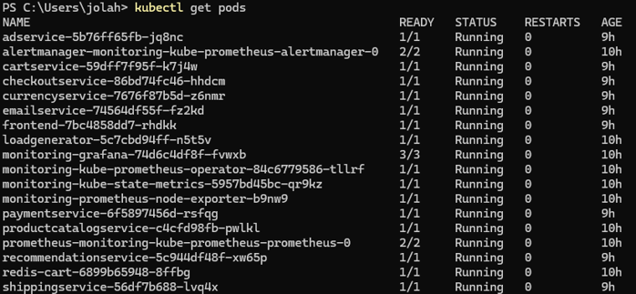


### Recovery

Upon automatic removal of the partition at T+60s, the failure rate dropped to 0.00 failures/s immediately. The 8 failures recorded during the experiment represent the total blast radius — no additional failures were observed post-recovery.
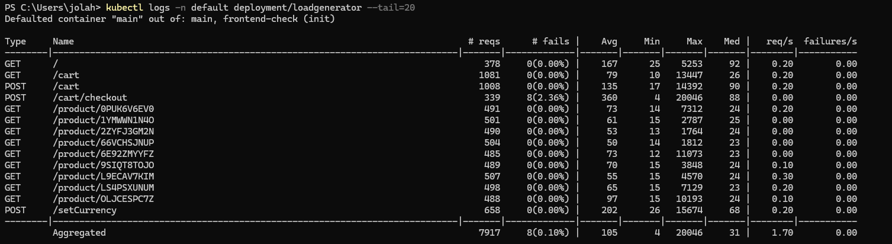

### Conclusions

- **Partial degradation confirmed.** The partition isolated failures exclusively to `POST /cart/checkout` (2.45% failure rate) while all 13 remaining endpoints maintained 0% failure rate, demonstrating effective blast radius containment.
- **Kubernetes self-healing does not apply to network failures.** Zero pod restarts occurred. Unlike crashed pods, a running-but-unreachable service is invisible to Kubernetes lifecycle mechanisms.
- **Absence of circuit breakers amplifies user impact.** Requests to the partitioned path were held open for the full 20-second timeout before failing, rather than fast-failing. A circuit breaker implementation would reduce this to milliseconds.
- **Recovery was instantaneous.** Upon partition removal at T+60s, `failures/s` returned to 0.00 immediately with no retry storms or state corruption observed.
- **Default probe timeouts (1s) caused unintended cluster-wide cascading failures in initial attempts.** Increasing timeouts to 10s was necessary to isolate the experiment to its intended scope.


### Injection Mechanism

Chaos Mesh implements network partition by injecting iptables rules directly into the network namespace of the targeted pod on the cluster node. When the experiment is applied, the Chaos Mesh daemon running on the node executes the equivalent of:
```
iptables -A OUTPUT -s <frontend-pod-IP> -d <checkoutservice-pod-IP> -j DROP
iptables -A INPUT  -d <frontend-pod-IP> -s <checkoutservice-pod-IP> -j DROP
```
These rules cause the kernel to silently drop all IP packets travelling between the two pods in the specified direction. Neither pod is aware of the rule — from the application's perspective, packets are sent but never arrive, and no TCP connection is ever established. This results in connection timeouts rather than immediate connection refused errors, which is why response times reached the full 20-second HTTP timeout threshold rather than failing fast.
When the experiment duration elapses, Chaos Mesh removes the injected iptables rules, restoring full network connectivity between the pods. Because the rules are stateless and operate at the packet level, recovery is instantaneous — no application restart or reconnection handshake is required.

## Experiment 3: CPU Stress

### Theory

Chaos Mesh implements CPU stress by injecting a stress workload directly into the target pod’s Linux cgroup and namespace using the embedded `stress-ng` utility. When the experiment is applied, the Chaos Mesh daemon running on the node launches CPU-intensive worker processes inside the selected container, equivalent to:

```bash
stress-ng --cpu 2 --cpu-load 90
```

*Note: If `stress-ng` is not available, it can be installed with: `sudo apt-get install stress-ng`*

This causes the injected worker threads to continuously execute computational operations in order to maintain approximately 90% utilization across the specified number of CPU cores. Because the stress process runs inside the same cgroup as the application container, it competes directly with the application for CPU scheduling time enforced by the Linux Completely Fair Scheduler (CFS).

From the application's perspective, no explicit failure occurs — the service remains reachable and functional, but receives significantly less CPU time for processing requests. As CPU saturation increases, request handling slows down, latency rises, and throughput decreases. Under sustained load, Kubernetes may additionally apply CPU throttling if container CPU limits are configured, further amplifying response delays.

When the experiment duration elapses, Chaos Mesh terminates the injected stress processes, immediately releasing CPU resources back to the application container. Since no application state or network configuration is modified, recovery is near-instantaneous and does not require pod restarts or connection re-establishment.

### Deployment

1. Create a CPU stress experiment manifest (Chaos Mesh `yaml`):

  ```yaml
  apiVersion: chaos-mesh.org/v1alpha1
  kind: StressChaos
  metadata:
    name: recommendation-cpu-stress
    namespace: chaos-testing
  spec:
    mode: one
    selector:
      namespaces:
        - boutique
      labelSelectors:
        app: recommendationservice
    stressors:
      cpu:
        workers: 2
        load: 90
    duration: '120s'
  ```

2. Apply the experiment:

  ```bash
  kubectl apply -f recommendation-cpu-stress.yaml
  ```

3. Observe CPU utilization:

  ```bash
  kubectl top pod -n boutique
  ```

  CPU usage before:
  

  CPU usage after:
  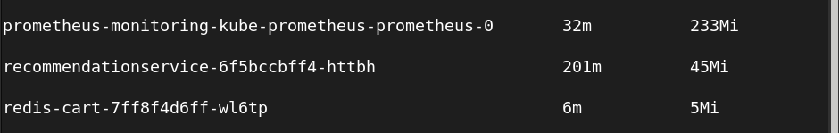

  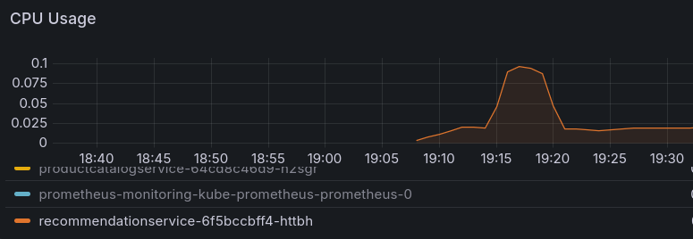

Application worked slower, but no failures were observed.

Useful Grafana metrics to observe:
* CPU saturation
* container CPU throttling
* request throughput
* latency increase
* service response times

1. Remove the experiment:

  ```bash
  kubectl delete -f recommendation-cpu-stress.yaml
  ```

## Experiment 4: Memory Stress Mechanism

### Theory

Chaos Mesh implements memory stress by injecting artificial memory pressure into the target pod using `stress-ng` memory allocation workers executed inside the container namespace. When the experiment is applied, the Chaos Mesh daemon launches processes equivalent to:

```bash
stress-ng --vm 1 --vm-bytes 512M
```

These worker processes continuously allocate and access large regions of memory, forcing the container to consume a significant portion of its available RAM. Because the stress workload executes within the same Kubernetes cgroup as the application, the memory usage is accounted against the pod’s configured memory limits.

From the application’s perspective, the service initially continues to operate normally, but available memory gradually decreases. As memory pressure increases, the Linux kernel may reclaim page cache, trigger swap activity (if enabled), or invoke the Out-Of-Memory (OOM) killer once the container exceeds its memory limit. In Kubernetes, this typically results in container termination and automatic pod restart according to the deployment policy.

Unlike network-based chaos experiments, memory stress can therefore lead to hard application failures rather than degraded performance alone. During the experiment, Grafana metrics typically show rapidly increasing memory utilization, potential OOM kill events, elevated restart counts, and temporary spikes in request errors while the affected pod is recreated.

### Deployment

1. Create a memory stress experiment manifest (Chaos Mesh `yaml`):

  ```yaml
  apiVersion: chaos-mesh.org/v1alpha1
kind: StressChaos
metadata:
  name: cart-memory-stress
  namespace: chaos-testing
spec:
  mode: one
  selector:
    namespaces:
      - boutique
    labelSelectors:
      app: cartservice
  stressors:
    memory:
      workers: 1
      size: '512MB'
  duration: '120s'
  ```

2. Apply the experiment:
  
   ```bash
   kubectl apply -f cart-memory-stress.yaml
   ```

3. Observe pod resource usage:
  
   ```bash
    kubectl top pod -n boutique
   ```

4. Watch for OOM restarts:
  
   ```bash
   kubectl get pods -n boutique -w
   ```

  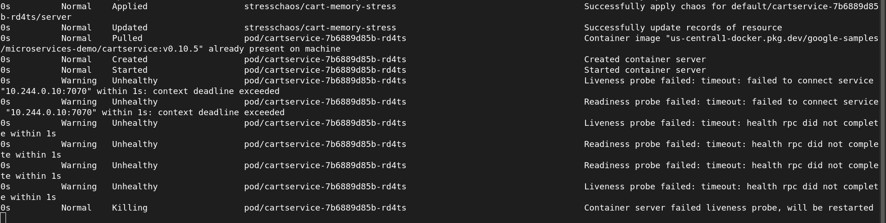

  

5. Inspect pod termination reason:
  
  ```bash
  kubectl describe pod <cartservice-pod-name> -n boutique
  ```

  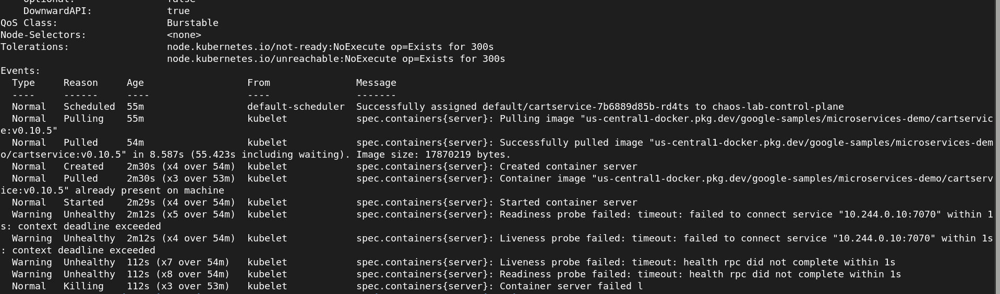

Useful Grafana metrics to observe:

  * memory utilization
  * OOM kill events
  * pod restart count
  * request error rate
  * service instability

1. Remove the experiment:
   ```bash
   kubectl delete -f cart-memory-stress.yaml
   ```
